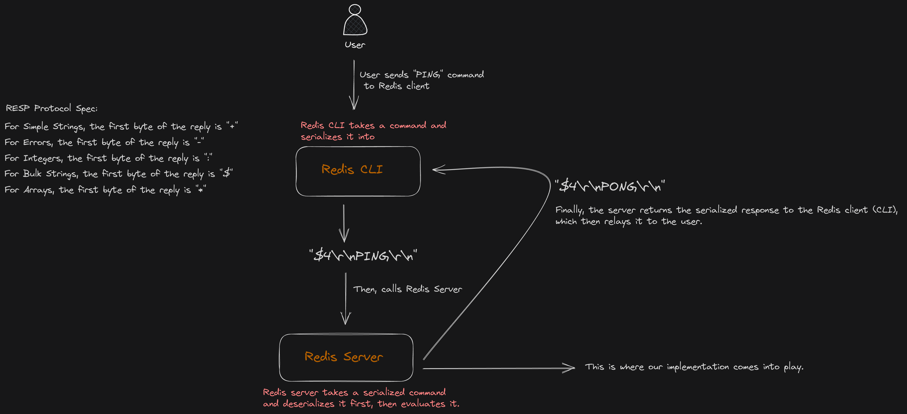

# Redis Server Implementation in NodeJS and TypeScript

This project offers a streamlined implementation of a Redis server. Built with the power of Rust. Originally port of : [Valinor Vault](https://github.com/ogzhanolguncu/valinor-vault/)

## Features

### RESP (Redis Serialization Protocol) Specification

We've adopted the official RESP to ensure seamless communication in our system.

### Core Commands

- **GET**: Fetch the associated value of a given key.
- **SET**: Assign a specific value to a key.
- **DEL**: Erase a key and its corresponding value.
- **EXISTS**: Verify the presence of a key in the system.
- **INCR**: Increment the integer value of a key by 1.
- **DECR**: Decrement the integer value of a key by 1.

### List Operations

- **LPUSH**: Add one or more values to the beginning of a list.
- **RPUSH**: Add one or more values to the end of a list.
- **LRANGE**: Retrieve a subset of the list stored at a key.

### Expiration Commands

- **EX**: Assign a key's time-to-live in seconds.
- **PX**: Designate a key's time-to-live in milliseconds.
- **EXAT**: Pinpoint an exact expiration timestamp for a key in seconds.
- **PXAT**: Pinpoint an exact expiration timestamp for a key in milliseconds.

### Little Sketch

We've included a diagram below to offer a clearer perspective on this implementation. This visualization should help elucidate the inner workings and flow of our Redis server replica.

